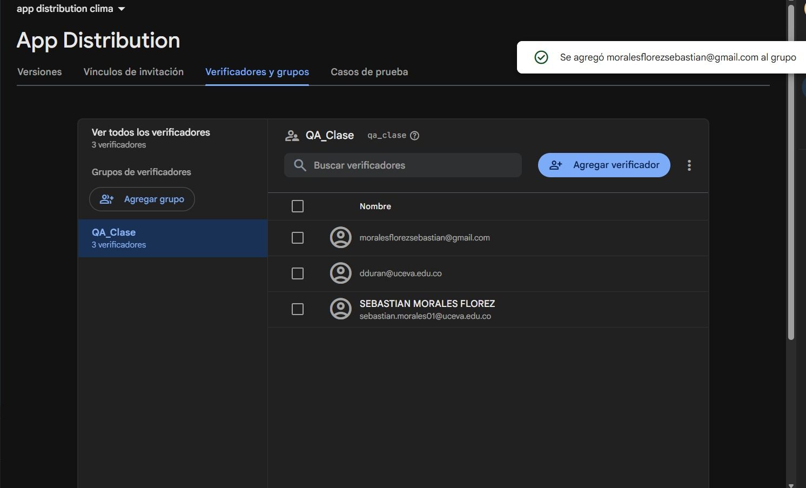
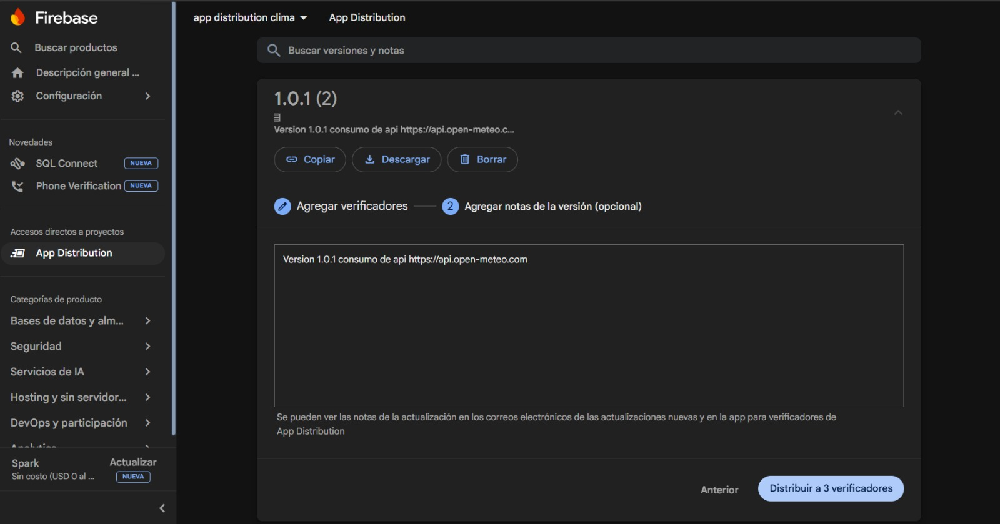
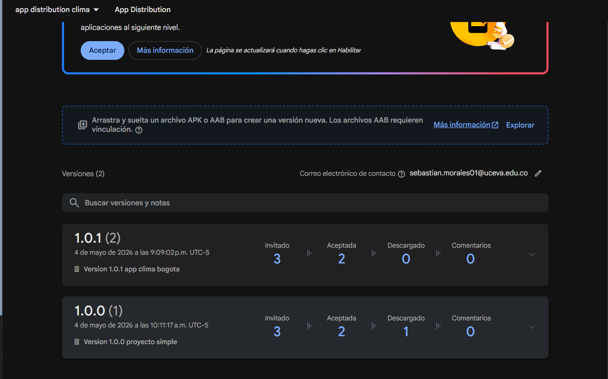
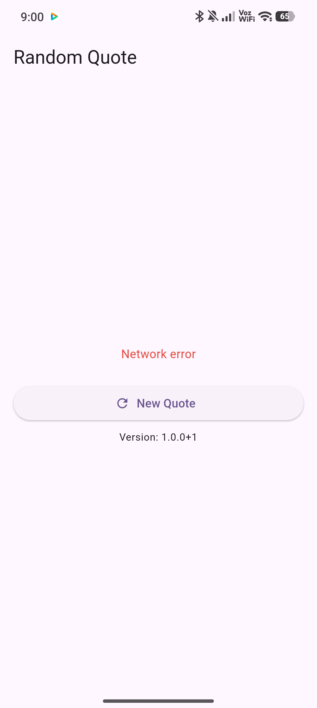
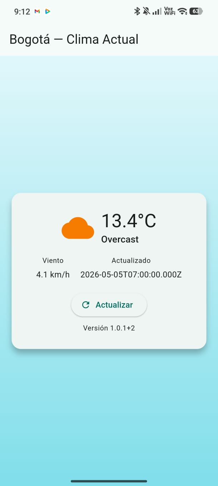

## app_distribution

Proyecto simple en Flutter que muestra el clima en Bogotá consumiendo una API de clima (p. ej. OpenWeatherMap).

Nota: la primera versión publicada (`v1.0`) fue un intento fallido; la versión funcional y actual es `1.0.1+2`.

Flujo (breve):

- Generar APK → App Distribution → Testers → Instalación → Actualización

Sección: Publicación (resumen y cómo reproducirlo en tu equipo)

Requisitos previos:

- Tener Flutter instalado y configurado.
- Tener acceso al proyecto de Firebase y el archivo `google-services.json` en `android/app/`.
- (Opcional) Instalar y autenticarse con la Firebase CLI (`npm install -g firebase-tools`) y habilitar App Distribution.

Pasos resumidos (por consola):

1) Preparar y compilar APK de release:

```bash
flutter pub get
flutter build apk --release
```

El APK generado queda en `build/app/outputs/flutter-apk/app-release.apk`.

2) Distribuir en Firebase App Distribution (dos opciones):

- Opción A — Firebase Console (UI):
	- Ir a Firebase Console → App Distribution.
	- Registrar la app Android (si no está registrada) usando el `applicationId` en `android/app/build.gradle`.
	- Crear un grupo de testers (ej.: `QA_Clase`) y añadir emails (ej.: `dduran@uceva.edu.co`).
	- Subir `app-release.apk`, añadir Release Notes, asignar al grupo y distribuir.

- Opción B — Firebase CLI (reproducible en equipo):
	- Autenticar: `firebase login` y seleccionar el proyecto con `firebase use --add`.
	- Distribuir:

```bash
firebase appdistribution:distribute build/app/outputs/flutter-apk/app-release.apk \
	--app YOUR_FIREBASE_APP_ID \
	--groups QA_Clase \
	--release-notes "Formato: v1.0.1+2 — Correcciones: - arreglado X; Mejoras: - mejora Y"
```

	- Reemplaza `YOUR_FIREBASE_APP_ID` por el ID de tu aplicación Android en Firebase (puedes encontrarlo en Firebase Console bajo Project Settings → Your apps).

Notas sobre replicabilidad:

- Asegúrate de que `google-services.json` corresponda al proyecto Firebase que usas.
- Configura el mismo `applicationId` en `android/app/build.gradle` y en Firebase.
- El miembro que haga el `firebase login` debe tener permisos para distribuir en App Distribution.

Versionado y formato de Release Notes

- Formato en `pubspec.yaml`: `version: major.minor.patch+build`
	- Ejemplo: `version: 1.0.1+2` (donde `1.0.1` es la versión semántica y `2` es el código de compilación/incremental).

- Ejemplo claro de Release Notes (texto breve reproducible):

	v1.0.1+2 — 2026-05-04
	- Correcciones: Soluciona error al refrescar cita cuando la conexión falla.
	- Mejoras: Optimiza tiempo de carga inicial.

	(Formato: `v<versión> — <fecha>` seguido de viñetas cortas con `Correcciones` y `Mejoras`.)

Capturas / GIFs del panel (opcional)

- Recomendación: incluir 2–3 capturas o un GIF corto mostrando:
	1. Subida del APK en Firebase Console (panel de App Distribution).
	2. Configuración del grupo de testers.
	3. Ejemplo del email o enlace de instalación recibido por un tester.

- Si ya tienes un PDF con evidencias, enlázalo desde aquí o añade las imágenes en una carpeta `docs/` y referencia el PDF.
	- Ejemplo enlace desde PDF: "Ver evidencias (capturas/GIFs) en el [PDF de evidencia](docs/evidencia.pdf)".

Archivos de interés

- App entry: [lib/main.dart](lib/main.dart)
- APK output: `build/app/outputs/flutter-apk/app-release.apk`
- Android manifest: [android/app/src/main/AndroidManifest.xml](android/app/src/main/AndroidManifest.xml)

Si quieres, puedo automatizar la subida mediante la Firebase CLI, crear un script `scripts/distribute.sh` o preparar un PDF de evidencia con capturas y enlaces.

## Evidencias (capturas)

Las capturas se encuentran en la carpeta `ScreenShoots/`. Haz click en cada imagen para verla en tamaño completo.

<div style="display:flex;flex-wrap:wrap;gap:16px;align-items:flex-start">
	<figure style="width:320px;margin:0">
		<a href="ScreenShoots/nuevo%20release.jpg"></a>
		<figcaption style="text-align:center;font-size:90%">Releases en App Distribution</figcaption>
	</figure>

	<figure style="width:320px;margin:0">
		<a href="ScreenShoots/agregartestersprimeraapk.jpg"></a>
		<figcaption style="text-align:center;font-size:90%">Testers (dduran@uceva.edu.co)</figcaption>
	</figure>

	<figure style="width:320px;margin:0">
		<a href="ScreenShoots/Captura%20de%20pantalla%202026-05-04%20094229.png"></a>
		<figcaption style="text-align:center;font-size:90%">Correo de invitación</figcaption>
	</figure>

	<figure style="width:240px;margin:0">
		<a href="ScreenShoots/nuevoapk.jpg"></a>
		<figcaption style="text-align:center;font-size:90%">App instalada</figcaption>
	</figure>

	<figure style="width:240px;margin:0">
		<a href="ScreenShoots/apksjuntas.png"></a>
		<figcaption style="text-align:center;font-size:90%">App abierta (clima en Bogotá)</figcaption>
	</figure>

	<figure style="width:320px;margin:0">
		<a href="ScreenShoots/version1.0.0.jpg"></a>
		<figcaption style="text-align:center;font-size:90%">Versión antes (v1.0.0)</figcaption>
	</figure>

	<figure style="width:320px;margin:0">
		<a href="ScreenShoots/version1.0.1.jpg"></a>
		<figcaption style="text-align:center;font-size:90%">Versión después (v1.0.1+2)</figcaption>
	</figure>

</div>

Si los nombres de los archivos son distintos, renombra las imágenes o actualiza las rutas arriba.

## Getting Started

This project is a starting point for a Flutter application.

A few resources to get you started if this is your first Flutter project:

- [Learn Flutter](https://docs.flutter.dev/get-started/learn-flutter)
- [Write your first Flutter app](https://docs.flutter.dev/get-started/codelab)
- [Flutter learning resources](https://docs.flutter.dev/reference/learning-resources)

For help getting started with Flutter development, view the
[online documentation](https://docs.flutter.dev/), which offers tutorials,
samples, guidance on mobile development, and a full API reference.
