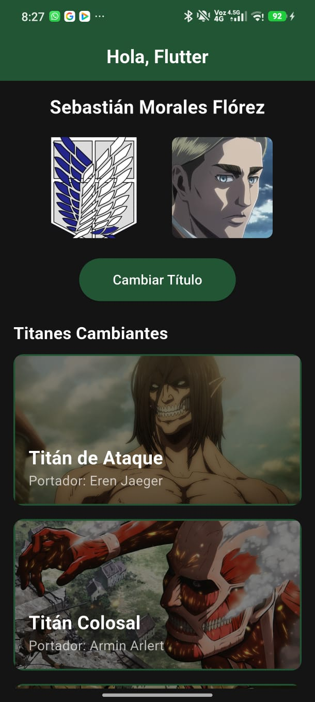
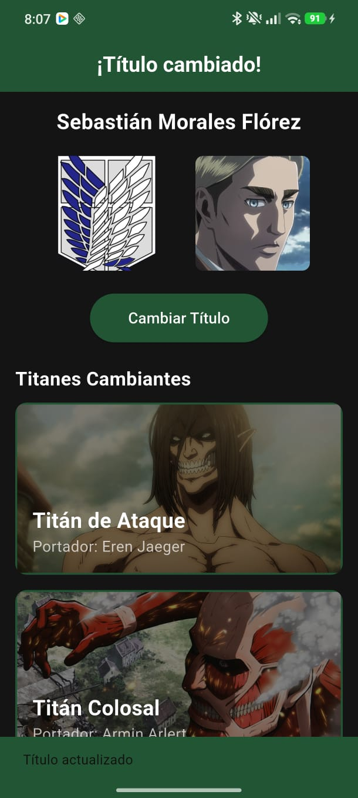

# 📱 Taller 1: Flutter - StatefulWidget y setState()

Este repositorio contiene la solución al primer taller práctico de la asignatura de Programación Móvil. El proyecto se centra en la construcción de una interfaz dinámica que reacciona a eventos del usuario mediante la gestión de estados.

---

## 👤 Datos del Estudiante
* **Nombre Completo:** Sebastián Morales Flórez
* **Código Estudiantil:** 230231002
* **Institución:** Unidad Central del Valle del Cauca (UCEVA)
* **Semestre:** Séptimo Semestre - Ingeniería de Sistemas

---

## 📝 Descripción del Taller
El objetivo de este taller fue construir una aplicación funcional en Flutter que cumpliera con los siguientes hitos:
1. **Gestión de Estado:** Implementación de un `StatefulWidget` donde un botón alterna el título de la `AppBar` y dispara un `SnackBar` informativo.
2. **Layout y Multimedia:** Organización de elementos mediante filas y columnas, integrando imágenes tanto de red (`Image.network`) como locales (`Image.asset`).
3. **Widgets Avanzados:** Uso de `ListView` para scroll de datos, `Expanded` para control de renderizado y `Stack` para diseño de capas sobrepuestas en tarjetas personalizadas.
4. **Git Flow:** Manejo de ramas (`main`, `dev`, `feature/taller1`) para un control de versiones profesional.

---

## Capturas




## 🚀 Pasos para Ejecutar el Proyecto

Para correr esta aplicación en un entorno local o emulador, siga estos comandos en la terminal:

1. **Clonar el repositorio:**
   ```bash
   git clone https://github.com/Sebasmf5/TalleresDesarrolloMovil.git

2. Obtener las dependencias
    ```bash
    flutter pub get

3. Ejecutar la aplicación
    ```bash
    flutter run